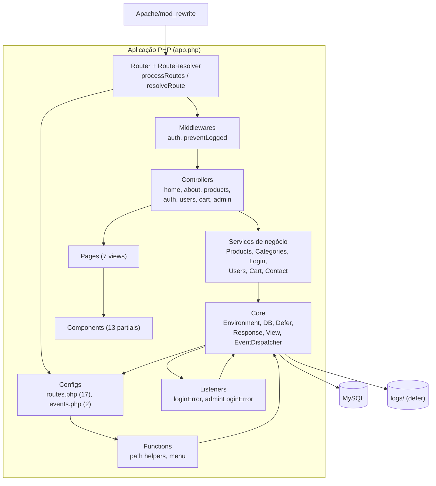

# C4 — Diagrama de Componentes (Nível 3)

> Gerado pelo **Arquiteto** em 2026-08-12. 🟢 CONFIRMADO
> Container foco: **Aplicação PHP** (único container com componentes internos relevantes).



## Componentes e responsabilidades

| Componente | Arquivos | Responsabilidade |
|------------|----------|------------------|
| **Core** | `src/Services/{Environment,DB,Defer,Response,View,EventDispatcher}.php` | Infraestrutura: env, queries, buffer/response, dispatch de eventos, execução defer |
| **Router** | `src/Services/Router.php`, `RouteResolver.php` | Resolver rota por método + string/regex, encadear middlewares, carregar controllers |
| **Configs** | `src/Configs/routes.php`, `events.php` | Declaração declarativa de rotas e eventos |
| **Controllers** | `src/Controllers/*` (7) | Callbacks por rota: montar args, chamar services, responder/redirecionar |
| **Services negócio** | `src/Services/{Products,Categories,Login,Users,Cart,Contact}/` | Regras de negócio + queries |
| **Middlewares** | `src/Middlewares/auth.php`, `preventLogged.php` | Controle de acesso por sessão |
| **Listeners** | `src/Listeners/*.php` (2) | Reação a eventos de login recusado (defer de log) |
| **Functions** | `src/Functions/Functions.php` | Helpers de path e menu (isMenuAllowed, isMenuActive, getMenuItens) |
| **Pages** | `src/Pages/` (7) | Views server-rendered |
| **Components** | `src/Components/` (13) | Partials reutilizáveis (layout, navbar, product, auth, cart) |

## Fluxo de dependência típico

```
Request → Router → Middlewares → Controller → Service → Core(DB) → Core(View) → Response
                                                              ↓
                                              Events → Listeners → Defer (pós-flush)
```

## Acoplamentos observados

- **Controllers** dependem de Services e do Core (via `$configs`); não tocam o banco diretamente 🟢.
- **Services** dependem do Core (DB) e de `types.php` para shapes 🟢.
- **Views** dependem de Components e de dados tipados do controller 🟢.
- Sem inversão de dependências (procedural por decisão — ADR-001) — acoplamento implícito por funções globais e `$configs` 🟡.
