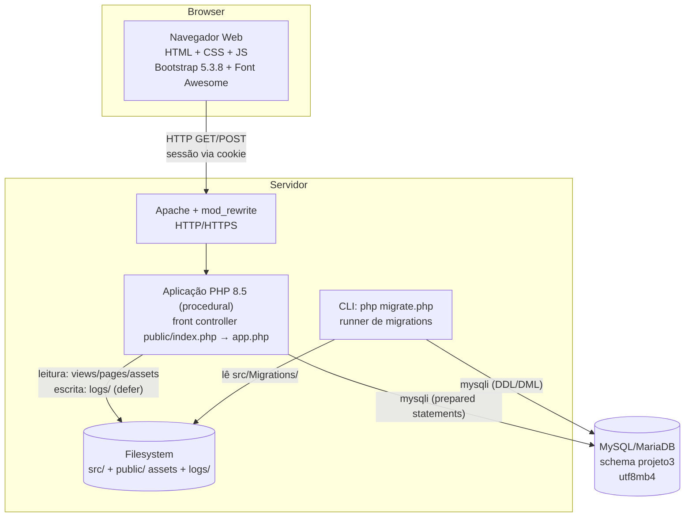

# C4 — Diagrama de Containers (Nível 2)

> Gerado pelo **Arquiteto** em 2026-08-12. 🟢 CONFIRMADO

## Containers

| Container | Tecnologia | Responsabilidade |
|-----------|------------|------------------|
| **Navegador** | HTML/CSS/JS, Bootstrap 5.3.8 + Font Awesome 7 (vendored) | Renderização server-side; sem SPA/AJAX |
| **Apache + mod_rewrite** | Web server | Roteia tudo para `public/index.php` (front controller) |
| **Aplicação PHP** | PHP 8.5 procedural, `mysqli`, sessões, sem Composer | Todo o comportamento do sistema |
| **CLI migrate** | `php migrate.php` | Executa migrations pendentes (runner próprio) |
| **MySQL** | MariaDB/MySQL | Persistência: 7 tabelas de negócio + `migrations` |
| **Filesystem** | Disco | `src/` (código), `public/assets` (estático), `logs/` (runtime) |

## Fluxos

- **HTTP**: Browser → Apache → Aplicação (sessão por cookie; `httponly`, sem `samesite`/`secure` 🟡).
- **Dados**: Aplicação/CLI → MySQL via `mysqli`; prepared statements com tipos `s`/`i`.
- **Logs**: Aplicação → Filesystem `logs/` após flush da resposta (defer).
