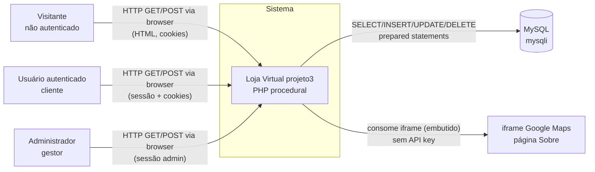

# C4 — Diagrama de Contexto (Nível 1)

> Gerado pelo **Arquiteto** em 2026-08-12. 🟢 CONFIRMADO

## Atores

| Ator | Interação | Cartinho |
|------|-----------|----------|
| **Visitante** | Navega catálogo, usa página Sobre, adiciona itens ao carrinho (cookie), tenta login | cookie `cart_items` (30 dias) |
| **Usuário** | Tudo do visitante + perfil (nome/senha) + carrinho persistente | banco (`carts`/`cart_items`) |
| **Administrador** | Login/logout admin apenas — sem painel funcional (ADR-010) | — |

## Sistemas externos

- **MySQL** — único sistema externo de dados; comunicação via `mysqli` (TCP).
- **Google Maps (iframe)** — consumo passivo, sem troca de dados com a aplicação.
- **Nenhuma** integração de API REST, webhook, pagamento ou e-mail.

## Notas

- Não há atores humanos "sistemas externos" além do usuário final.
- Logs de login falho são escritos em arquivo local (`logs/`) — não é sistema externo.
