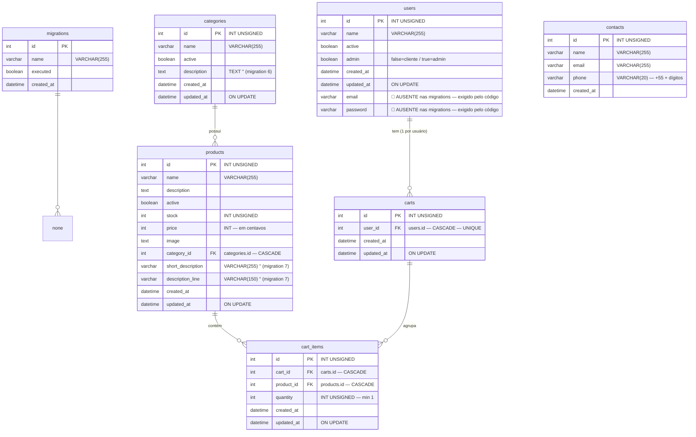

# ERD Completo — projeto3

> Gerado pelo **Arquiteto** em 2026-08-12.
> Escala: 🟢 CONFIRMADO | 🟡 INFERIDO | 🔴 LACUNA
> Banco: MySQL/MariaDB, InnoDB, utf8mb4/utf8mb4_unicode_ci.

## Cardinalidades

| Relação | Tipo | Regra |
|---------|------|-------|
| categories → products | 1:N | `products.category_id` NOT NULL, CASCADE delete/update |
| products → cart_items | 1:N | `cart_items.product_id` NOT NULL, CASCADE |
| users → carts | 1:1 | `carts.user_id` UNIQUE, CASCADE |
| carts → cart_items | 1:N | `cart_items.cart_id` NOT NULL, CASCADE |
| migrations | — | tabela de controle do runner (sem FKs) |
| contacts | — | independente (sem FKs) |

## Observações e lacunas

1. 🔴 **users.email / users.password** — ausentes nas migrations (ADR-008); exigidos por `LoginService`, `UsersService` e `Pages/Users/profile.php`. `email` era `VARCHAR(255) UNIQUE` na versão original da migration 8.
2. 🔴 **Migration 7** — cláusulas `AFTER` mutuamente referenciadas (ADR-009); colunas `short_description`/`description_line` existem no código mas a migration tende a falhar em banco limpo.
3. 🟢 `users.admin` BOOLEAN separa cliente (`false`) de admin (`true`) — modelo de RBAC binário.
4. 🟢 Sem tabela de pedidos/checkout; `cart_items` é o estado máximo da compra.
5. 🟢 `contacts` não possui `updated_at` (apenas `created_at`).
6. 🟡 Sem índices adicionais explícitos além de PKs/UNIQUE/FKs (nenhum `KEY` extra em migrations — consultas por `active`, `email`, `category_id` dependem dos FKs/index implícitos).
