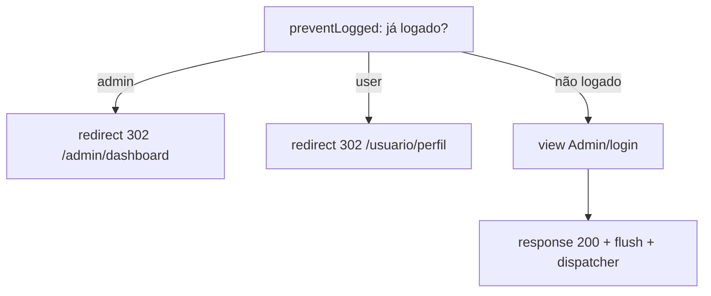
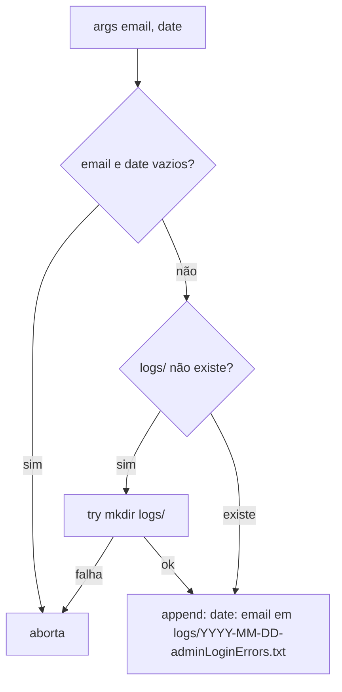

# Fluxograma — admin

> Gerado pelo **Arqueólogo** em 2026-08-12. 🟢 CONFIRMADO

## makeAdminLogin (GET /admin/login, middleware preventLogged)



## adminLoginAuthenticate (POST /admin/login)

```mermaid
flowchart TD
    A[POST email, password] --> B[email = strtolower trim]
    B --> C[validateLoginInfo: obrigatórios, email válido, senha >= 8]
    C -->|inválido| D[dispara AdminLoginRecused email+date]
    D --> E[response 401 view Admin/login]
    C -->|válido| F[SELECT * FROM users WHERE email=? AND active=true AND admin=true LIMIT 1]
    F --> G{usuário admin encontrado?}
    G -->|não| H[password_verify DUMMY_HASH]
    H --> I[return DEFAULT_LOGIN_ERROR]
    I --> D
    G -->|sim| J{password_verify senha?}
    J -->|não| I
    J -->|sim| K[$_SESSION['admin'] = dados do usuário]
    K --> L[redirect 302 /admin/dashboard]
```

> ✅ RESOLVIDO (P3): `/admin/dashboard` é rota **planejada** — a página será criada posteriormente. O redirect pós-login permanece como destino de sucesso.

## doAdminLogout (GET /admin/logout)

```mermaid
flowchart TD
    A[GET /admin/logout] --> B[unset $_SESSION['admin']]
    B --> C[redirect 303 /admin/login]
```

## Listener AdminLoginRecused (pós-resposta, via defer)



## Escopo atual do admin

- O módulo **admin** hoje contém **apenas** autenticação (login GET/POST e logout). Não há dashboard, CRUD de produtos, categorias ou usuários implementados — apesar de rotas serem referenciadas no menu/navbar.
