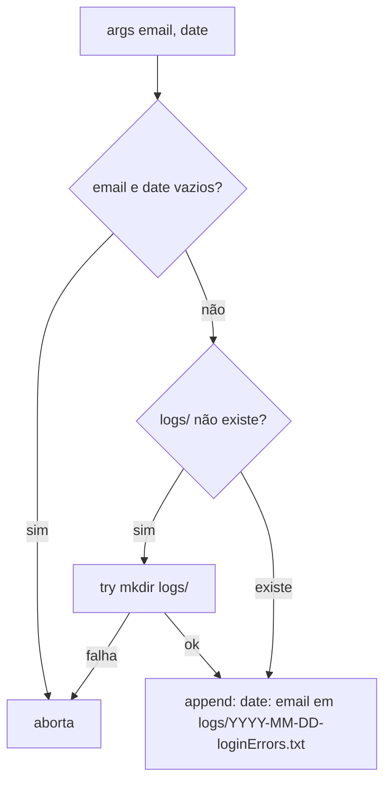

# Fluxograma — auth

> Gerado pelo **Arqueólogo** em 2026-08-12. 🟢 CONFIRMADO

## validateLogin (POST /login) — usuário

```mermaid
flowchart TD
    A[POST email, password] --> B[email = strtolower trim, password bruto]
    B --> C[validateLoginInfo]
    C --> D{email/password vazios?}
    D -->|sim| E1[falha 'Usuário e senha são obrigatórios']
    C --> E2{email inválido?}
    E2 -->|sim| E3[falha 'E-mail inválido']
    C --> E4{senha < 8 chars?}
    E4 -->|sim| E5[falha 'A senha deve ter pelo menos 8 caracteres']
    E1 --> ED[dispara evento LoginRecused email+date]
    E3 --> ED
    E5 --> ED
    ED --> R1[response 401 com view de login]
    C -->|válido| F[SELECT * FROM users WHERE email=? AND active=true AND admin=false LIMIT 1]
    F --> G{usuário encontrado?}
    G -->|não| H[password_verify com DUMMY_PASSWORD_HASH]
    H --> I[return DEFAULT_LOGIN_ERROR 'Usuário ou senha incorretos']
    I --> ED
    G -->|sim| J{password_verify senha?}
    J -->|não| I
    J -->|sim| K[$_SESSION['user'] = dados do usuário]
    K --> L[redirect 302 /usuario/perfil]
```

## Logout (GET /logout)

```mermaid
flowchart TD
    A[GET /logout] --> B{isset $_SESSION['admin']?}
    B -->|sim| C[redirect 303 /admin/logout]
    B -->|não| D[unset $_SESSION['user']]
    D --> E[redirect 303 /]
```

## Listener LoginRecused (pós-resposta, via defer)



## Middleware preventLogged (rotas de login)

```mermaid
flowchart TD
    A[entra middleware] --> B{isset $_SESSION['admin']?}
    B -->|sim| C[redirect 302 /admin/dashboard]
    B -->|não| D{isset $_SESSION['user']?}
    D -->|sim| E[redirect 302 /usuario/perfil]
    D -->|não| F[$next executa controller]
```

## Middleware auth (rotas de perfil)

```mermaid
flowchart TD
    A[entra middleware] --> B{session user id e active?}
    B -->|não| C[redirect 303 /logout]
    B -->|sim| D[getUserById do banco]
    D --> E{usuário ativo existe?}
    E -->|não| C
    E -->|sim| F[$configs['user'] = usuário do banco]
    F --> G[$next executa controller]
```
