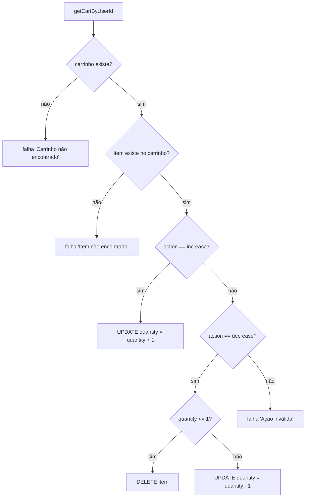

# Fluxograma — cart

> Gerado pelo **Arqueólogo** em 2026-08-12. 🟢 CONFIRMADO

## makeCart (GET /carrinho)

```mermaid
flowchart TD
    A[GET /carrinho] --> B{isset $_SESSION['user']?}
    B -->|sim| C[getCartByUserId]
    C --> D{carrinho existe?}
    D -->|sim| E[getCartItems JOIN products]
    D -->|não| F[items = [], total = 0]
    E --> G[calculateCartTotal: soma price*quantity]
    F --> V[view Cart/cart]
    G --> V
    V --> R[response 200 + flush + dispatcher]
    B -->|não| H[getCartItemsFromCookie]
    H --> I{cookie não vazio?}
    I -->|sim| J[enrichCartItemsWithProductData: só produtos ativos]
    J --> G
    I -->|não| F
```

## doAddToCart (POST /carrinho/adicionar)

```mermaid
flowchart TD
    A[POST product_id] --> B{product_id é int >= 1?}
    B -->|não| R[redirect 302 /produtos]
    B -->|sim| C{isset $_SESSION['user']?}
    C -->|sim| D[getOrCreateCart + INSERT/UPDATE cart_items quantity+1]
    C -->|não| E[cookie: incrementa ou adiciona id:1]
    D --> R2[redirect 302 /carrinho]
    E --> R2
```

## doUpdateCartQuantity (POST /carrinho/atualizar)

```mermaid
flowchart TD
    A[POST product_id, action] --> B{product_id int >= 1 E action ∈ increase/decrease?}
    B -->|não| R[redirect 302 /carrinho]
    B -->|sim| C{isset $_SESSION['user']?}
    C -->|sim| D[updateCartItemQuantity banco]
    C -->|não| E[updateCartItemQuantityCookie]
    D --> R2[redirect 302 /carrinho]
    E --> R2
```

## updateCartItemQuantity (banco)



## doRemoveCartItem (POST /carrinho/remover)

```mermaid
flowchart TD
    A[POST product_id] --> B{product_id int >= 1?}
    B -->|não| R[redirect 302 /carrinho]
    B -->|sim| C{isset $_SESSION['user']?}
    C -->|sim| D[DELETE cart_items WHERE cart_id AND product_id]
    C -->|não| E[remove item do cookie]
    D --> R2[redirect 302 /carrinho]
    E --> R2
```

## Cookie cart_items

- Formato: `productId:quantity,productId:quantity` (ex.: `3:2,7:1`).
- Parse tolerante: pares com 2 partes, `product_id >= 1`, `quantity >= 1`.
- Persistência: `setcookie('cart_items', ..., time()+86400*30, '/')` — 30 dias.
- Operações: add (incrementa ou adiciona), increase, decrease (remove se <= 1), remove.
