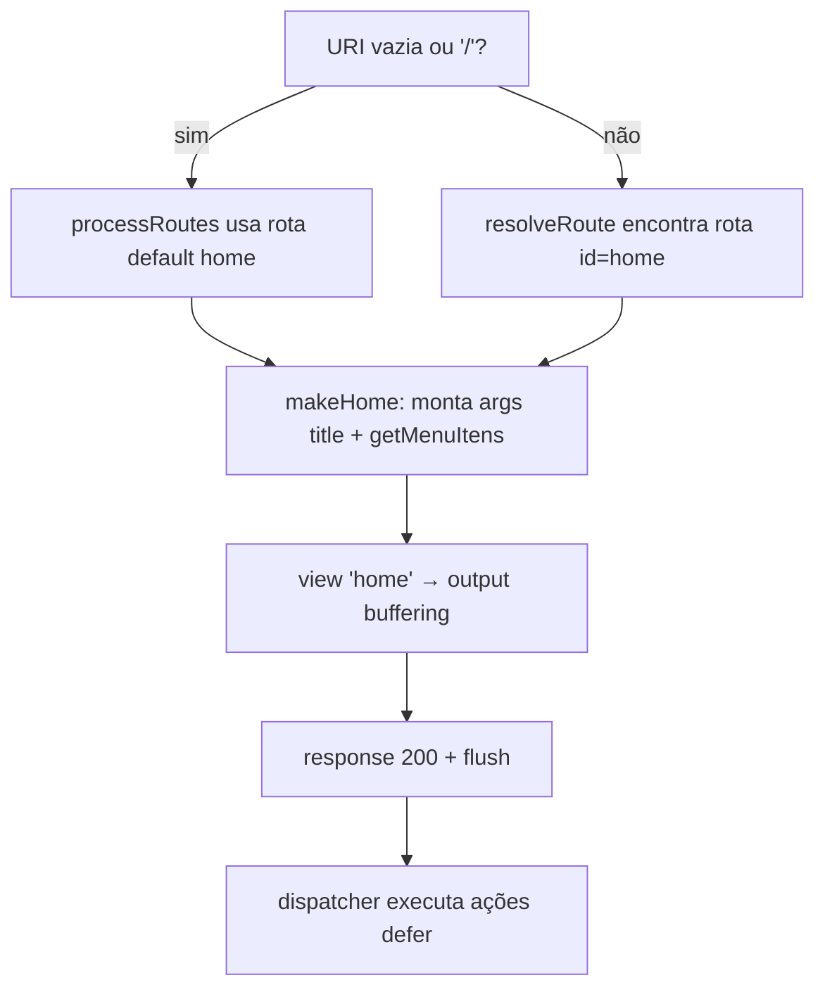

# Fluxograma — home

> Gerado pelo **Arqueólogo** em 2026-08-12. 🟢 CONFIRMADO

## makeHome (GET /)

```mermaid
flowchart TD
    A[URI vazia ou '/'?] -->|sim| B[processRoutes usa rota default home]
    A -->|não| C[resolveRoute encontra rota id=home]
    B --> D[makeHome: monta args title + getMenuItens]
    C --> D
    D --> E[view 'home' → output buffering]
    E --> F[response 200 + flush]
    F --> G[dispatcher executa ações defer]
```
