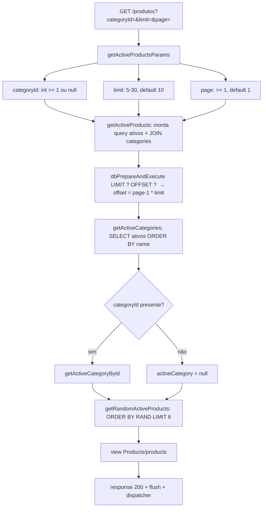
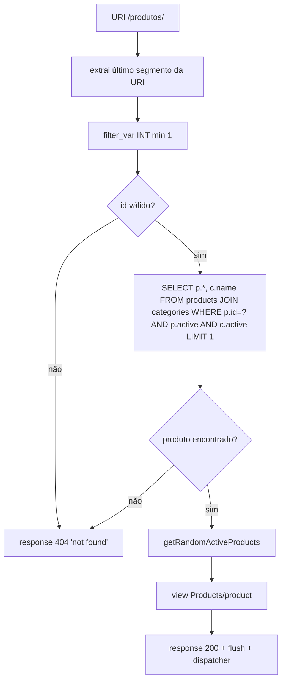

# Fluxograma — products

> Gerado pelo **Arqueólogo** em 2026-08-12. 🟢 CONFIRMADO

## makeProducts (GET /produtos)

```mermaid
flowchart TD
    A[GET /produtos?categoryId=&limit=&page=] --> B[getActiveProductsParams]
    B --> B1[categoryId: int >= 1 ou null]
    B --> B2[limit: 5-30, default 10]
    B --> B3[page: >= 1, default 1]
    B1 --> C[getActiveProducts: monta query ativos + JOIN categories]
    B2 --> C
    B3 --> C
    C --> D[dbPrepareAndExecute LIMIT ? OFFSET ?  → offset = page-1 * limit]
    D --> E[getActiveCategories: SELECT ativos ORDER BY name]
    E --> F{categoryId presente?}
    F -->|sim| G[getActiveCategoryById]
    F -->|não| H[activeCategory = null]
    G --> I[getRandomActiveProducts: ORDER BY RAND LIMIT 6]
    H --> I
    I --> J[view Products/products]
    J --> K[response 200 + flush + dispatcher]
```

## makeProduct (GET /produtos/{id})

```mermaid
flowchart TD
    A[URI /produtos/<id>] --> B[extrai último segmento da URI]
    B --> C[filter_var INT min 1]
    C --> D{id válido?}
    D -->|não| E[response 404 'not found']
    D -->|sim| F[SELECT p.*, c.name FROM products JOIN categories WHERE p.id=? AND p.active AND c.active LIMIT 1]
    F --> G{produto encontrado?}
    G -->|não| E
    G -->|sim| H[getRandomActiveProducts]
    H --> I[view Products/product]
    I --> J[response 200 + flush + dispatcher]
```
