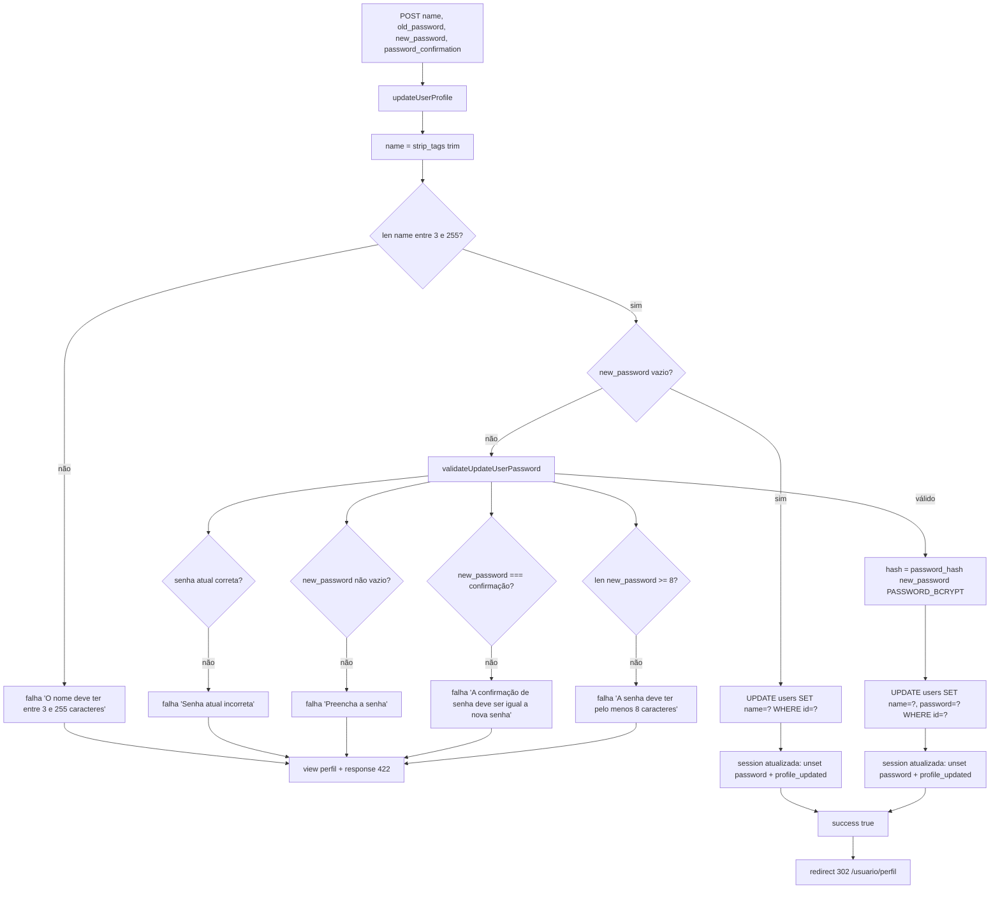

# Fluxograma — users

> Gerado pelo **Arqueólogo** em 2026-08-12. 🟢 CONFIRMADO

## viewProfile (GET /usuario/perfil, middleware auth)

```mermaid
flowchart TD
    A[authMiddleware injeta $configs['user'] do banco] --> B[view Users/profile com user, routes]
    B --> C[agenda defer: limpa $_SESSION['profile_updated']]
    C --> D[response 200 + flush + dispatcher]
```

## updateProfile (POST /usuario/perfil)



> 🔴 LACUNA: o `$_POST['email']` é apenas exibido (input disabled) e não é atualizado.
