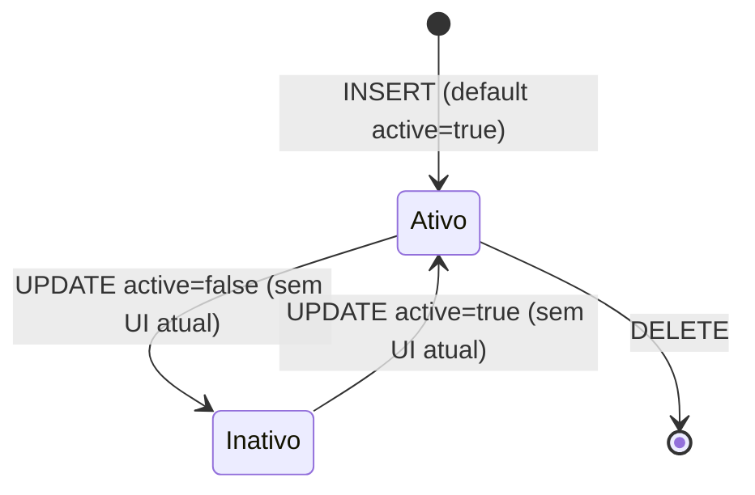
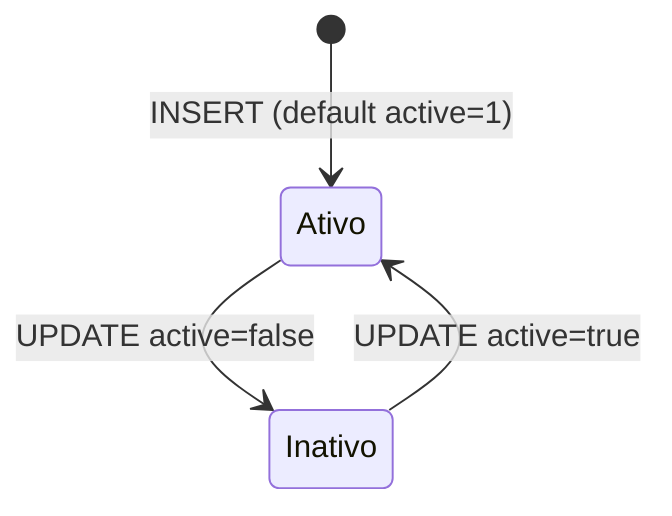
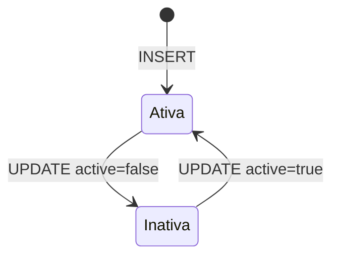
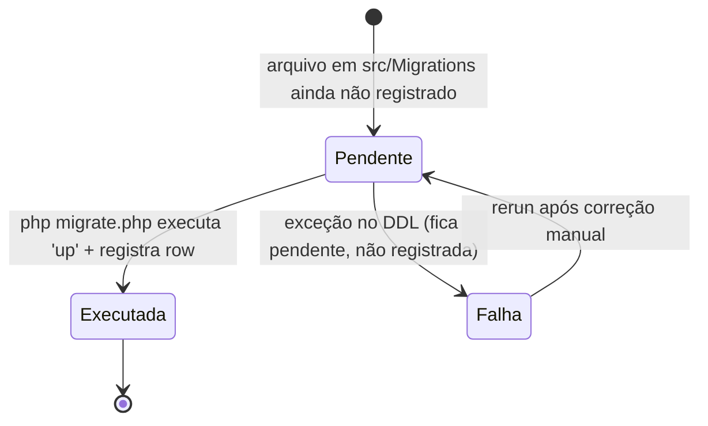
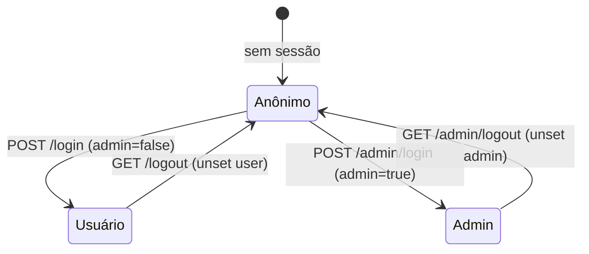

# Máquinas de Estado — projeto3

> Gerado pelo **Detetive** em 2026-08-12.
> Escala: 🟢 CONFIRMADO | 🟡 INFERIDO | 🔴 LACUNA

## 1. Usuário (`users.active`) 🟢

Acesso ao sistema é controlado por `active` (booleano). Não há UI para alternar hoje.



- **Ativo** → pode autenticar (user ou admin, conforme `admin`).
- **Inativo** → login bloqueado (`WHERE active = true`), middlewares `auth` rejeitam sessão.

> 🟡 INFERIDO: o único caminho de ida-e-volta é via UPDATE direto no banco; não há transição automática (ex.: bloqueio por tentativas).

## 2. Produto (`products.active`) 🟢



- **Ativo** → visível na listagem, página e carrinho (categoria também precisa estar ativa).
- **Inativo** → invisível no catálogo; itens de cookie inativos não são enriquecidos.

> 🟡 INFERIDO: transições apenas por UPDATE manual; sem agendamento/expiração de visibilidade.

## 3. Categoria (`categories.active`) 🟢



- **Ativa** → aparece no accordion/filtro; produtos ativos sob ela ficam visíveis.
- **Inativa** → escondida; produtos (mesmo ativos) somem da listagem (`p.active AND c.active`).

## 4. Migration (`migrations.executed`) 🟢

Machine de estado do runner CLI (`migrate.php`).



- A migration só é marcada `executed=1` se o `up` rodar sem erro.
- Ordem de execução: numérica do nome do arquivo (`1_`, `2_`, …).

## 5. Item de carrinho (`cart_items.quantity`) 🟢

```mermaid
stateDiagram-v2
    [*] --> q=1: add novo item
    q=1 --> q=2: increase
    q=n --> q=n+1: increase
    q=n --> q=n-1: decrease
    q=1 --> Removido: decrease (q<=1)
    q=n --> Removido: remove
    Removido --> [*]
```

- `quantity` nunca fica em 0 ou negativo (decrease com q≤1 remove).
- Aplicável tanto ao banco quanto ao cookie do visitante.

## 6. Sessão (stack de identidade) 🟡 INFERIDO



- Sessões `user` e `admin` são mutuamente exclusivas por construção (nunca definidas juntas no fluxo atual).
- Middleware `auth` só vale para a pilha de usuário.

## Resumo de entidades com estado

| Entidade | Campo | Estados | UI de transição |
|----------|-------|---------|-----------------|
| users | active | ativo / inativo | nenhuma 🔴 |
| products | active | ativo / inativo | nenhuma 🔴 |
| categories | active | ativa / inativa | nenhuma 🔴 |
| migrations | executed | pendente / executada | CLI `migrate.php` |
| cart_items | quantity | n ≥ 1 → removido | POST /carrinho/* |
| sessão | — | anônimo / usuário / admin | /login, /admin/login, /logout |
